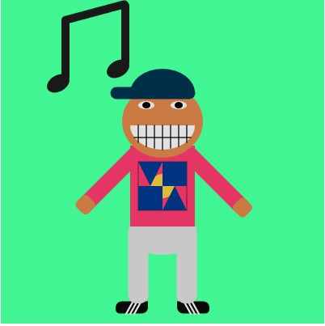
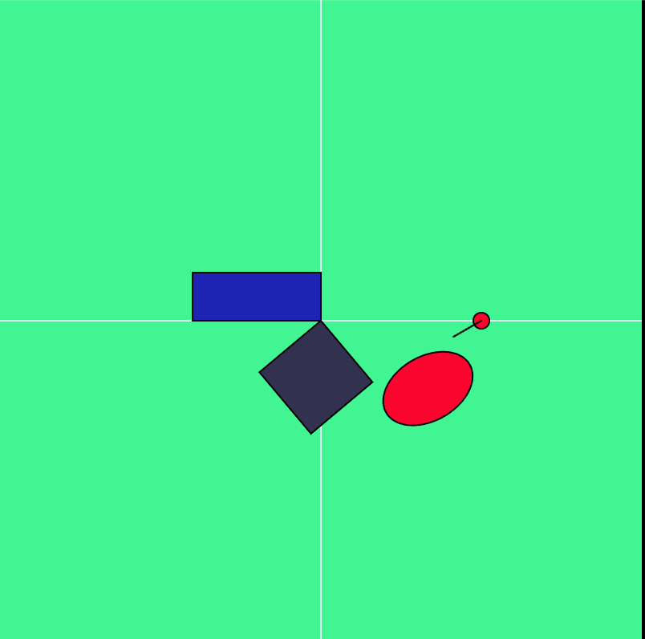
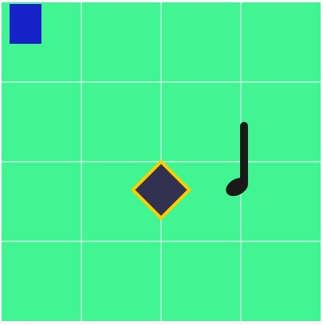
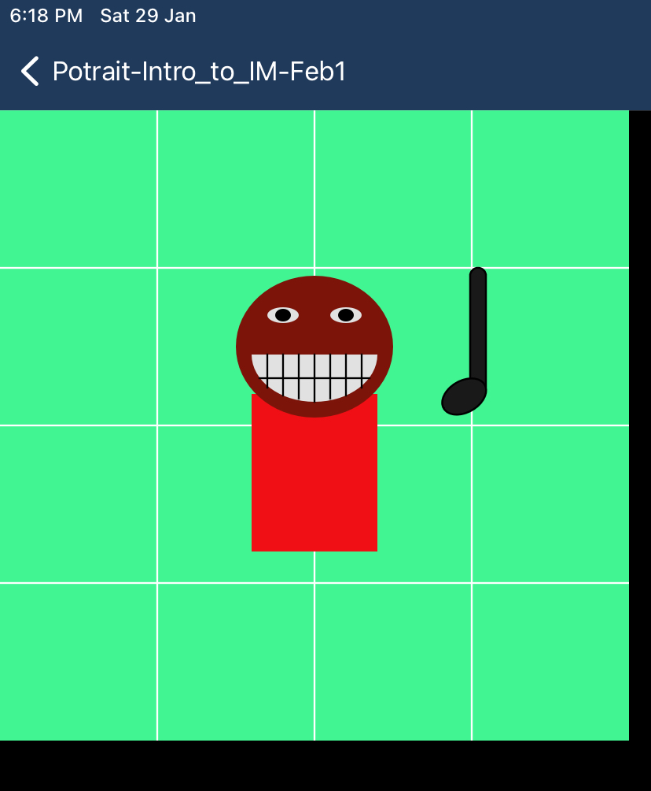
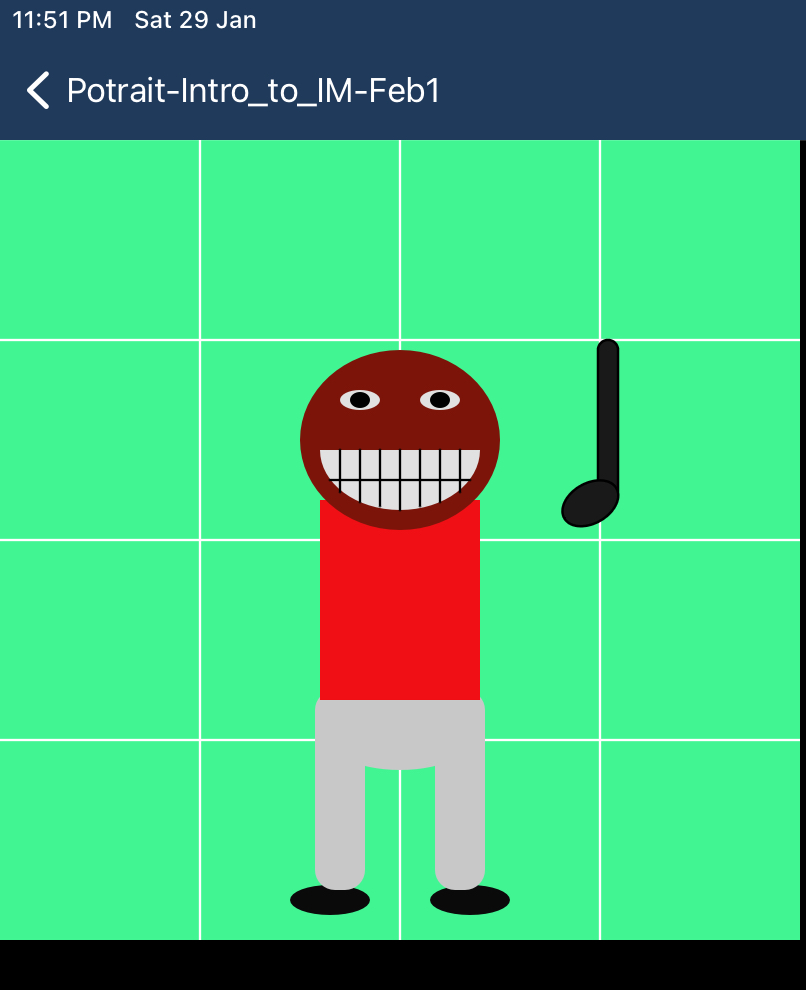
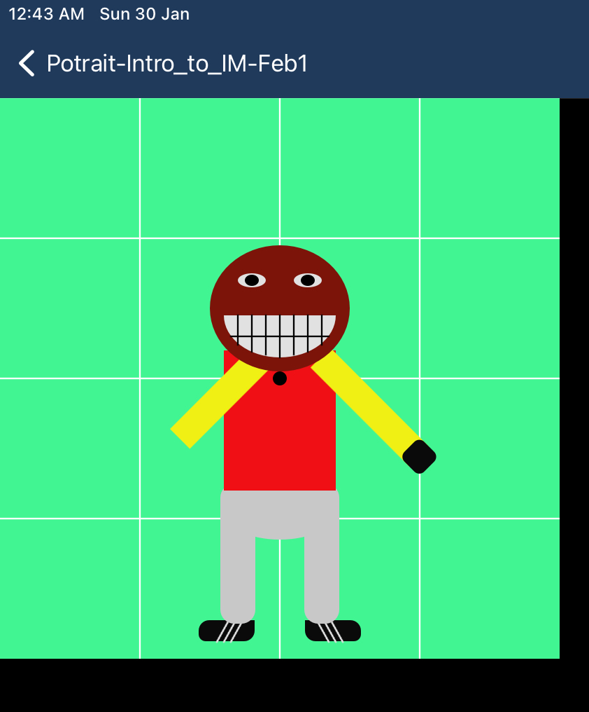
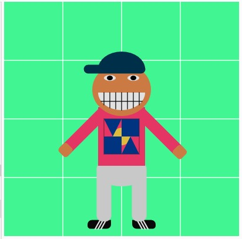
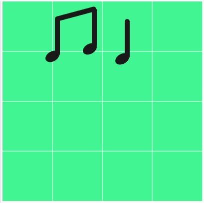
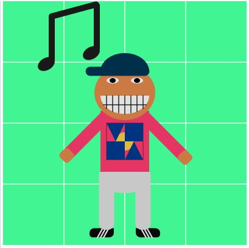

## Documentation
I managed to do a self potrait (more like a whole body drawing) by using simple 2D shapes and functions like `push()`, `pop()`, `translate()` and `rotate()`. After experimenting with this tools I managed to end up with the final design presented below:



Below are the notes of the challenges and the overall process through several days.

---
**Notes of the process by dates**
---
Jan 28:
I worked on understanding the function [rotate()](https://p5js.org/reference/#/p5/rotate), the reference page was not as useful because the rotations seemed to be random despite converting degrees to radians. Therefore, I used The Coding Train's series on transformations, particularly [Transformations Pt.1 (Translate, Rotate, Push/Pop)](https://www.youtube.com/watch?v=o9sgjuh-CBM). Through this I understood the role that the function [translate()](https://p5js.org/reference/#/p5/translate), and I managed to do a simple animation of an ellipse rotating around a specific point. 

Even though the assignment does not require animation, understanding how `rotate()` works is useful to do shapes that are at a particular angle. For this I have already branched my main repository to do experiments on the file `potrait.js`. I hope to further explore and start developing the self potrait with diverse elements.

Below is a screenshot of the result up to this point and the source code:


````

//program that rotates a circle around point (300,200)
let angle = 60;

function setup() {
   createCanvas(400, 400);
   //rectMode(CENTER)
}

function draw() {
   background(66, 245, 147);
   stroke(255);
   line(0, 200, 400, 200); // x-axis
   line(200, 0, 200, 400); //y-axis
   //------------------
   
   translate(200, 200);
   fill(50, 50, 80);
   stroke(0);
   //-------------
   push();
   rotate(radians(50));
   rect(0, 0, 50, 50);
   pop();
   //-------------
   fill(30, 35, 180);
   //rotate(radians(-45));
   push();
   rotate(radians(180));
   rect(0, 0, 80, 30);
   pop();
   //-------------
   fill(250, 5, 45);
   translate(100, 0);
   ellipseMode(CENTER); // rotates around center of shape
   ellipse(0, 0, 10);
   push();
   ellipseMode(CORNER); // rotates around upper left corner
   rotate(radians(angle));
   
   ellipse(0, 20, 40, 60);
   line(0, 0, 0, 20);
   //angle = angle + 1; // rotation variable
   pop();
}
````

--- 
Jan 29:
a) Drawing a musical note
After learning some of the new functions like [resetMatrix()](https://p5js.org/reference/#/p5/resetMatrix), I looked experimenting using the knowledge from yesterday and the new one. The main objective was to draw a quater musical note. I wanted to add this as I like music making and I play the violin (drawing a violin with simple shapes seems like a challenging task for now). Thus, I tried out the knowledge acquired for transformations to work on these changes. And the result for now is the following:



(Code until this point)
````
/*
File: Potrait-Intro_to_IM-Feb1
Date: 
Name: Daniel Nivia (dno220)
Description: Program in p5js that draw's a self-potrait. 
Uses 2D primitives and some transform functions.
*/

function setup() {
  //----
  createCanvas(400, 400);
  // putting the background here reduces the quality of the shapes
}

function draw() {
  //----
  //setting up
  background(66, 245, 147); // turquoise background color
  stroke(255); // white lines to show the center
  //grid for drawing around
  line(0, 200, 400, 200); // x-axis
  line(200, 0, 200, 400); //y-axis
  //upper left cuadrant
  line(0, 100, 400, 100);
  line(100, 0, 100, 400);
  //bottom left cuadrant
  line(0, 300, 400, 300);
  //right cuadrants
  line(300, 0, 300, 400);
  //----
  fill(20,34,200)
  //----
  //----
  // general adjustments
  translate(200, 200); // sets origin to (200,200)
  noStroke(); // sets no stroke to all unless stated to add stroke
  //----
  //TEST Rectangle
          push();
      fill(50, 50, 80); // greyish blue
      rotate(radians(45)); // rotate 50 degrees from top left corner from origin (200,200)
      strokeWeight(4) // stroke weight
      stroke(255, 204, 0) // added stroke
      rect(0, 0, 50, 50);
          pop();
  
  //----
  //the stem of the musical note
          push();
      fill(25)
      rect(99, -50, 10, 80,5); // -50 because origin is (200,300)
          pop();
  //----
  //----
  //head of the musical note
  translate(100, 0); // changes origin to (300,200)
          push();
      ellipseMode(CENTER); 
      rotate(radians(60)); // rotate 60 degrees
      fill(25);
      ellipse(25, 20, 20, 30); // the rotation affects calculation
                               //of where the ellipse goes but in
                               //theory is 25x, 20y from (300,200) 
          pop();
  //----
  //reseting the matrix [origin back to (0,0)]
  resetMatrix();
  rect(10,2,40,50);
  //----
}

````
---
Jan 29 - 30:
Thanks to the application [Processing for iOS](https://processing-app.org/) (available in the App Store) I was able to work on my iPad offline and experimenting more with my potrait. I was working this way as I was travelling by bus to Expo and needed to use time effectively. Below are the screenshots of the different versions of the potrait. As I had no internet in the bus defining the skin color was not easy and ended with a dark brown, now that I have the internet I will update that.







---
Jan 30: In this version of the potrait, most of the elements are finished, I am hoping just to add some music notes because I like music. This last task is quite challenging due to the rotation element of the music note head. I managed to draw it and it was shown in images 2 to 4, but I eliminated it to focus on the other elements of the potrait. The design in the middle of the shirt is a logo I came up during Foundations of Graphic Design in Fall 2019 for an assignment. I wanted to add it because I feel it is part of me as an artist. In additio, drawing this shape allowed me to practice the `triangle()` function which I had yet to experiment with.



Code until this point:
````
/*
File: Potrait-Intro_to_IM-Feb1
Date: 
Name: Daniel Nivia (dno220)
Description: Program in p5js that draw's a self-potrait. 
Uses 2D primitives and some transform functions.
*/

function setup() {
  //----
  createCanvas(400, 400);
  // putting the background here reduces the quality of the shapes
}

function draw() {
  //----
  //----setting up----\\
  background(66, 245, 147); // turquoise background color
  stroke(255); // white lines to show the center
  //grid for drawing around
  line(0, 200, 400, 200); // x-axis
  line(200, 0, 200, 400); //y-axis
  //upper left cuadrant
  line(0, 100, 400, 100);
  line(100, 0, 100, 400);
  //bottom left cuadrant
  line(0, 300, 400, 300);
  //right cuadrants
  line(300, 0, 300, 400);
  //---- test fill and shape ----\\
  //   fill(20,34,200)
  //		rect(10,10,40,30)
  //----

  //----
  // general adjustments
  translate(200, 150); // origin (200,150)
  noStroke(); // sets no stroke to all unless stated to add stroke
  //----

  //---- FEET ----\\
  //shoes adidas 3 stripes
  push();
  fill(10);
  resetMatrix(); // reset to (0,0)
  translate(200, 350); // temporary new origin for push and pop
  rectMode(CENTER);
  rect(-38, 30, 40, 15, 10, 0, 10, 5); // left shoe
  rect(38, 30, 40, 15, 0, 10, 5, 10); // right shoe
  stroke(225);
  strokeWeight(2.25); // weight of the lines
  //left shoe lines
  line(-35, 20, -45, 38); // line 1 left foot
  line(-30, 20, -40, 38); // line 2 left foot
  line(-25, 20, -35, 38); // line 3 left foot
  //right shoe lines
  line(35, 20, 45, 38); // line 1 right foot
  line(30, 20, 40, 38); // line 2 right foot
  line(25, 20, 35, 38); // line 3 right foot
  pop();
  //--------------\\
  //---- LEGS ----\\
  push();
  fill(200);
  rect(-40, 120, 80, 40); //width of the body
  ellipse(0, 145, 80, 40);
  rectMode(CENTER);
  //-------------
  rect(30, 175, 25, 100, 10); // legR
  rect(-30, 175, 25, 100, 10); // legL >> this works without the reset
  //-------------

  pop();

  //--------------\\
  //---- BODY and ARMS ----\\
  //blue sandwich bleu logo in the middle
  resetMatrix();
  translate(200, 200);
  fill(229, 53, 100); // color of the body
  rect(-40, -20, 80, 100); // body
  // right arm

  push();
  fill(229, 53, 100); // color of the arm
  rectMode(CENTER);
  rotate(radians(45));
  rect(60, -30, 100, 20);

  fill(203, 122, 67); //skin color fixed
  rect(110, -30, 20, 20, 5);
  pop();

  //fill(0);
  //ellipse(0,0,10);

  // left arm
  push();
  fill(229, 53, 100); // color of the arm
  rectMode(CENTER);
  rotate(radians(45)); // 45
  rect(-30, 60, 20, 100);
  fill(203, 122, 67); //skin color fixed
  rect(-30, 105, 20, 20, 5); // left hand
  pop();
  //--------------\\

  //BLUE SANDWICH LOGO
  push();
  resetMatrix(); // set origin to (0,0)
  translate(200,200); // set origin to (200,200)
  fill(229,53,100); // square surrounding logo
  strokeWeight(0.5);
  stroke(0)
  rect(-30,0,60)
  noStroke();
  fill(222,187,61);
  ellipse(0,30,30); // POSITION will change later
  fill(0,51,128);
  rect(0,0,30); // top right square
  rect(-30,30,30)// bottom left square
  triangle(-30,0,-15,30,0,0); // top left triangle
  triangle(0,60,15,30,30,60);//bottom right triangle
  pop();
  //---- FACE ----\\
  // drawing the head
  push();
  resetMatrix();
  translate(200, 150);
  ellipseMode(CENTER);
  fill(203, 122, 67); //skin color fixed
  ellipse(0, 0, 100, 90);
  pop();
  //--
  //--drawing the smile with teeth
  fill(225);
  resetMatrix(); // reset to (0,0)
  translate(200, 150); // return to (200,150)
  arc(0, 5, 80, 60, 0, radians(180), OPEN);

  //--teeth
  stroke(0);
  strokeWeight(1.25);
  line(-35, 20, 35, 20); // horizontal line for teeth
  line(0, 5, 0, 35); // middle line teeth
  // right side
  line(10, 5, 10, 33); // right1
  line(20, 5, 20, 31); // right2
  line(30, 5, 30, 26); // right3
  // left side
  line(-10, 5, -10, 33); // left1
  line(-20, 5, -20, 31); // left2
  line(-30, 5, -30, 26); // left3

  //--eyes
  push();
  noStroke(); // no keeping outerline in shapes

  //right eye
  ellipseMode(CENTER);
  fill(225);
  ellipse(20, -20, 20, 10);
  fill(0); // black eye
  ellipse(20, -20, 10, 8);
  //left eye
  fill(225);
  ellipse(-20, -20, 20, 10);
  fill(0); // black eye
  ellipse(-20, -20, 10, 8);
  pop();

  //--------------\\

  //----Hat----\\
  push();
  resetMatrix();
  translate(200, 100);
  noStroke();
  fill(0, 48, 73);

  rotate(radians(180));
  arc(0, -15, 80, 60, 0, radians(180), OPEN);
  rectMode(CENTER);
  //fill(100)
  rect(12, -15, 105, 15, 10);
  pop();

  //---- Music Notes ----\\
  // quater note
  //the stem of the musical note

  // two eighth notes
  //----
}

````
---
Jan 30: Drawing music notes
I decided to start a clear canvas (except the background and the grid I created) to draw some musical notes. In order to do this I used the code in which I had already drawn a music shape and adapted it. I wanted to draw two eighth notes and a quarter note. I was able to complete this with the following result and code:



````
/*
File: Potrait-Intro_to_IM-Feb1
Date: 
Name: Daniel Nivia (dno220)
Description: Program in p5js that draw's a self-potrait. 
Uses 2D primitives and some transform functions.
*/

function setup() {
  //----
  createCanvas(400, 400);
  // putting the background here reduces the quality of the shapes
}

function draw() {
  //----
  //----setting up----\\
  background(66, 245, 147); // turquoise background color
  stroke(255); // white lines to show the center
  //grid for drawing around
  line(0, 200, 400, 200); // x-axis
  line(200, 0, 200, 400); //y-axis
  //upper left cuadrant
  line(0, 100, 400, 100);
  line(100, 0, 100, 400);
  //bottom left cuadrant
  line(0, 300, 400, 300);
  //right cuadrants
  line(300, 0, 300, 400);
  //---- test fill and shape ----\\
  //   fill(20,34,200)
  //		rect(10,10,40,30)
  //----

  //---- Music Notes ----\\

  //the stem of the musical note
  noStroke();
  push();
  
  resetMatrix(); // origin to (0,0)
  fill(25);
  rectMode(CENTER);
  // two eighth notes stems vertical
  rect(110, 70, 10, 80, 5); // -w = 10, h = 80, round edges = 5
  rect(184, 52, 10, 80, 5);
  // stem for quarter note
  rect(250, 75, 10, 80, 5);
  
  pop();
  //----
  
  //----
  //heads of the musical notes
  translate(100, 110); // changes origin to (100,110)
  
  push();
  ellipseMode(CENTER); // center of the ellipse works as reference point for translations and rotations
  rotate(radians(60)); // rotate 60 degrees
  fill(25);
  ellipse(0, 0, 20, 30);
  pop();
  
  translate(75, -15); // (125,100)
  //--------------
  push();
  ellipseMode(CENTER);
  rotate(radians(60)); // rotate 60 degrees from the new origin
  fill(25);
  ellipse(0, 0, 20, 30);
  pop();
  //--------------
  push();
  resetMatrix();
  translate(240, 115);
  ellipseMode(CENTER);
  rotate(radians(60)); // rotate 60 degrees from the new origin
  fill(25);
  ellipse(0, 0, 20, 30);
  pop();
  //--------------
  // HORIZONTAL STEM joining eighth note stems
  push();
  resetMatrix();
  translate(146.5, 25);
  rectMode(CENTER);
  fill(25);
  rotate(radians(-15)); // joining stem horizontally
  rect(0, 0, 85, 10, 5);
  pop();
  //--------------
}

````

However, I did not took into account how it would fit in my drawing that I had drawn. Therefore, I decided to only do the eighth notes and adjusted the parameters to fit inside the drawing. In general drawing musical notes is very challenging and in my final code I need to clean and comment it as clear as possible in order to follow the steps. Below is the pre final result of my drawing.



Jan 31:
I just eliminated the grid that I had with white strokes and cleaned up the comments I had for each of the sections. The final version of my potrait it is shown at the beginning of the file.
