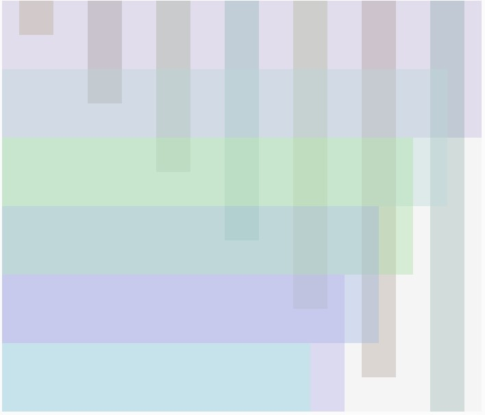

## Documentation 

---
## Notes of processes by dates 
---

Feb 5:
This project was harder to begin with as I was not sure how to approach it. Nonetheless after reviewing some videos from The Coding Train, specifically: 
  - [2.4: random() Function - p5.js Tutorial](https://www.youtube.com/watch?v=POn4cZ0jL-o&list=PLRqwX-V7Uu6Zy51Q-x9tMWIv9cueOFTFA&index=11)
  - [4.2: Nested Loops - p5.js Tutorial](https://www.youtube.com/watch?v=1c1_TMdf8b8&list=PLRqwX-V7Uu6Zy51Q-x9tMWIv9cueOFTFA&index=20)
  - [5.2: Function Parameters and Arguments - p5.js Tutorial](https://www.youtube.com/watch?v=zkc417YapfE&list=PLRqwX-V7Uu6Zy51Q-x9tMWIv9cueOFTFA&index=22) 

it gave me inspiration for the idea I had in mind. I was planning to do a series of shapes from ellipses, squares and triangles from one corner to another, at the end of the opposite corner I was thinking to do something with lines. Thinking about using the random() function will prove to be important for changing the color, the size and the stroke weight. Below it is a sketch I did on the iPad


---

Feb 6: 

Even though my plan still remains with only using ellipses, squares and triangles, I wanted to share a code example that I found for polygons. In a different variation of my artwork I would of use this code, but I feel that it would require more time to understand fully this function. Here is share the link to the code and the code itself.

[Regular Polygon](https://p5js.org/examples/form-regular-polygon.html)

```` 
// CODE EXAMPLE FROM https://p5js.org/examples/form-regular-polygon.html
// Function to do regular polygons rotating
function setup() {
  createCanvas(720, 400);
}

function draw() {
  background(102);

  push();
  translate(width * 0.2, height * 0.5);
  rotate(frameCount / 200.0);
  polygon(0, 0, 82, 3);
  pop();

  push();
  translate(width * 0.5, height * 0.5);
  rotate(frameCount / 50.0);
  polygon(0, 0, 80, 20);
  pop();

  push();
  translate(width * 0.8, height * 0.5);
  rotate(frameCount / -100.0);
  polygon(0, 0, 70, 7);
  pop();
}

function polygon(x, y, radius, npoints) {
  let angle = TWO_PI / npoints;
  beginShape();
  for (let a = 0; a < TWO_PI; a += angle) {
    let sx = x + cos(a) * radius;
    let sy = y + sin(a) * radius;
    vertex(sx, sy);
  }
  endShape(CLOSE);
}
````
---
The first part that I worked was producing a series of horizontal and vertical rectangles overlapped each other. I applied the Alpha transparency to my colors so that they blended each other rather than covering completely. In order to produce these rectangles I called a function that had 8 arguments for creating the rectangle and for defining the color (4 each). I decided to do a nested loop so I first I drew

````

// runs once at the beginning
function setup() {
  createCanvas(700, 600);
  background(245);
  
  //variables for 
  let xSize = 700
  let ySize = 50
  
  //horizontal lines > yCoor changes for where the rectangle starts
  for(yCoor = 0; yCoor <= 600; yCoor += 100 ){
    
    //call function to draw the rectangles with random colors
    designBackground(0, yCoor, xSize, 200, random(155,255), random(155,255), random(155,255),100);  
    xSize -= 50;
    // vertical lines
    for(xCoor = 25; xCoor <= 700; xCoor +=100){
      if (ySize ===  750 ){
          break;
      }else{
            //print(ySize); // this was to debug an issue I was having in the drawing
            designBackground(xCoor, 0, 50, ySize, random(55,155), random(55,155), random(55,155),50); 
            ySize += 100;
          }
      
    } // second for loop
    
  } // first for loop
}

//input: 8 numbers, x and y coordinates, width, height, RGBA
//output: produces rectangles in horizontal and vertical depending on the input
function designBackground(xCoor, yCoor, wid, hgt, r, g, b, a) {
    
  // settings for the rectangles
  noStroke();
  fill(r,g,b,a);
  rect(xCoor,yCoor, wid, hgt);
  
}

````
---
Below is some of the patterns generated by the program. As the `random()` function is used the color results are different each time. The idea is now to add the shapes using only the strokes on top of these color patterns. I might explore on the use of classes to produce each shape, but I am still new with this topic so I am not sure how I will use it.




---
I continued to work on the code and experimented with classes as shown in the [tutorials 6.1 to 6.4](https://www.youtube.com/playlist?list=PLRqwX-V7Uu6Zy51Q-x9tMWIv9cueOFTFA) of Daniel Shiffman in his channel The Coding Train. Personally it was interesting using this method to create the specific object with the properties that I wanted. Nonetheless, I felt I was writing multiple lines of code that I could also execute as a function and use for or while loops to automate the process. Therefore, tomorrow my plan is to change this classes into functions and use the loops to clean up the repetitive lines that I currently see in my code. Below I share the current code and the results of three different images.

**Code:**

````

// runs once at the beginning
function setup() {
  createCanvas(700, 600);
  background(245);
  
  //variables for the FOR loops
  let xSize = 700
  let ySize = 50
  
  //horizontal lines > yCoor changes for where the rectangle starts
  for(yCoor = 0; yCoor <= 600; yCoor += 100 ){
    
    //call function to draw the rectangles with random colors
    designBackground(0, yCoor, xSize, 200, random(155,255), random(155,255), random(155,255),100);  
    xSize -= 50;
    // vertical lines
    for(xCoor = 25; xCoor <= 700; xCoor +=100){
      if (ySize === 750){
          break;
      }else{
            //print(ySize); // this was to debug an issue I was having in the drawing
            designBackground(xCoor, 0, 50, ySize, random(55,155), random(55,155), random(55,155),50); 
            ySize += 100;
          }
      
    } // second for loop ending
    
  } // first for loop ending
  
  // calling the objects to create
  
  //CIRCLES
  circle1 = new Circles(random(0,200), random(400,600), random(10,100),random(2,10));
  circle1.show();
  
  circle2 = new Circles(random(0,200), random(400,600), random(10,100),random(2,10));
  circle2.show();
  
  circle3 = new Circles(random(0,200), random(400,600), random(10,100),random(2,10));
  circle3.show();
  
  circle4 = new Circles(random(0,200), random(400,600), random(10,100),random(2,10));
  circle4.show();
  
  circle5 = new Circles(random(0,200), random(400,600), random(10,100),random(2,10));
  circle5.show();
  
  circle6 = new Circles(random(0,200), random(400,600), random(10,100),random(2,10));
  circle6.show();
  
  circle7 = new Circles(random(0,200), random(400,600), random(10,100),random(2,10));
  circle7.show();
  
  circle8 = new Circles(random(0,200), random(400,600), random(10,100),random(2,10));
  circle8.show();
  
  //RECTANGLES
  
  rect1 = new Rectangles(random(300,500), random(200,400), random(10,50), random(10,50), random(2,10));
  rect1.show();
  
  rect2 = new Rectangles(random(300,500), random(200,400), random(10,50), random(10,50), random(2,10));
  rect2.show();
  
  rect3 = new Rectangles(random(300,500), random(200,400), random(10,50), random(10,50), random(2,10));
  rect3.show();

  rect4 = new Rectangles(random(300,500), random(200,400), random(10,50), random(10,50), random(2,10));
  rect4.show();
  
  rect5 = new Rectangles(random(300,500), random(200,400), random(10,50), random(10,50), random(2,10));
  rect5.show();
  
  rect6 = new Rectangles(random(300,500), random(200,400), random(10,50), random(10,50), random(2,10));
  rect6.show();
  
  rect7 = new Rectangles(random(300,500), random(200,400), random(10,50), random(10,50), random(2,10));
  rect7.show();
  
  rect8 = new Rectangles(random(300,500), random(200,400), random(10,50), random(10,50), random(2,10));
  rect8.show();
}

//input: 8 numbers, x and y coordinates, width, height, RGBA
//output: produces rectangles in horizontal and vertical depending on the input
function designBackground(xCoor, yCoor, wid, hgt, r, g, b, a) {
    
  // settings for the rectangles
  noStroke();
  fill(r,g,b,a);
  rect(xCoor,yCoor, wid, hgt);
  
}


class Circles{
  //initial function to start the class
  constructor( posX,posY, siz,sizStroke) // name
  {
    //this.name = name;
    this.posX = posX;
    this.posY = posY;
    this.siz = siz;
    this.sizStroke = sizStroke;
    
  }
  
  // position(x,y), size, color Stroke, size Stroke
  show(){
    noFill();
    stroke(random(0,200),random(0,255),random(200,255));
    strokeWeight(this.sizStroke);
    ellipse(this.posX, this.posY, this.siz);
    
  }
}

class Rectangles{
  //initial function to start the class
  constructor( posX,posY, sizX, sizY, sizStroke) // name
  {
    //this.name = name;
    this.posX = posX;
    this.posY = posY;
    this.sizX = sizX;
    this.sizY = sizY;
    this.sizStroke = sizStroke;
    
  }
  
  show(){
    noFill();
    stroke(random(0,255),random(200,255),random(0,200));
    strokeWeight(this.sizStroke);
    rectMode(CENTER);
    rect(this.posX, this.posY, this.sizX, this.sizY);

  }
  
}

````

**Images:**


---
Feb 7:
So I decided to clean yesterday's code by eliminating the classes and using a single for loop that let me iterate x times instead of copying the code 8 times like I did in the previous code. In this for loop I inserted three functions each to draw a circle, a rectangle, and a triangle. Using functions here was really useful as I did not had to create a variable for each shape, the function just received the arguments and did its magic. Every time the code is run it produces a unique result due to the random function in the colors, size and location, therefore I share here three final designs, and also the final code.

**Images:**


**Code:**

````

// runs once at the beginning
function setup() {
  createCanvas(700, 600);
  background(245);
  
  //variables for the FOR loops
  let xSize = 700
  let ySize = 50
  
  //horizontal lines > yCoor changes for where the rectangle starts
  for(yCoor = 0; yCoor <= 600; yCoor += 100 ){
    
    //call function to draw the rectangles with random colors
    designBackground(0, yCoor, xSize, 200, random(155,255), random(155,255), random(155,255),100);  
    xSize -= 50;
    // vertical lines
    for(xCoor = 25; xCoor <= 700; xCoor +=100){
      // condition to break the loop
      if (ySize === 750){
          break;
      }else{
            //print(ySize); // this was to debug an issue I was having in the drawing
            designBackground(xCoor, 0, 50, ySize, random(55,155), random(55,155), random(55,155),50); 
            ySize += 100;
          } // else statement
      
    } // second for loop ending
    
  } // first for loop ending
  
  
  // calling the objects to create
  //Circles, Rectangles and Triangles
  // I can decide how many times I run the code for example 100 times
  for(times = 1;times <= 30 ; times++){
    // calling the function to create a circle, rectangle and triangle each iteration
    circlesFunction(random(10,200), random(400,600), random(10,100),random(2,15));
    rectanglesFunction(random(300,500), random(200,400), random(25,75), random(25,75), random(2,15));
     trianglesFunction(random(500, 600), random(100, 400), random(610,660), random(10, 100), random(670, 690), random(50,200), random(2,10));
    
  } // for loop closing bracket 

} 

//input: 8 numbers, x and y coordinates, width, height, RGBA
//output: produces rectangles in horizontal and vertical depending on the input
function designBackground(xCoor, yCoor, wid, hgt, r, g, b, a) {
    
  // settings for the rectangles
  noStroke();
  fill(r,g,b,a);
  rect(xCoor,yCoor, wid, hgt);
  
}

//input: 4 numbers, the x and y coordinates, the size and the stroke weight
//output: produces circles with random blue related colors
function circlesFunction(xCoor, yCoor, siz, sizStroke){
  
    noFill();
    stroke(random(0,200),random(0,255),random(200,255));
    strokeWeight(sizStroke);
    ellipse(xCoor, yCoor, siz);
  
}


//input: 5 numbers, x and y coordinates , width and height, stroke weight
//output: produces rectangles with random green related colors
function rectanglesFunction(xCoor, yCoor, wid, hgt, sizStroke){
    noFill();
    stroke(random(0,255),random(200,255),random(0,200));
    strokeWeight(sizStroke);
    rectMode(CENTER);
    rect(xCoor, yCoor, wid, hgt);
}


//input: 7 numbers, 6 for each vertex of the triangle and stroke weight
//output: produces triangles with random red related colors
function trianglesFunction(x1,y1,x2,y2,x3,y3, sizStroke){
    noFill();
    stroke(random(200,255), random(0,255), random(0,200));
    strokeWeight(sizStroke);
    triangle(x1,y2,x2,y2,x3,y3);
  
}

````


