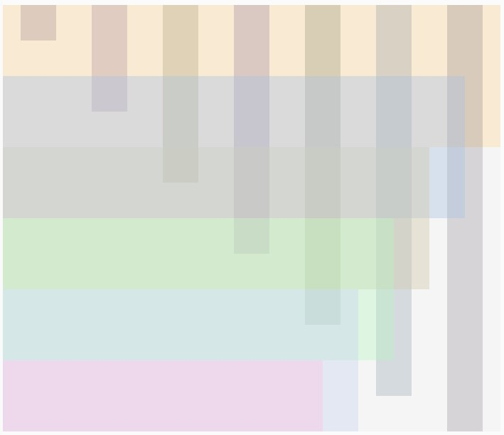

## Documentation 
---

---
## Notes of processes by dates 
---

Feb 5:
This project was harder to begin with as I was not sure how to approach it. Nonetheless after reviewing some videos from The Coding Train, specifically: 
  - [2.4: random() Function - p5.js Tutorial](https://www.youtube.com/watch?v=POn4cZ0jL-o&list=PLRqwX-V7Uu6Zy51Q-x9tMWIv9cueOFTFA&index=11)
  - [4.2: Nested Loops - p5.js Tutorial](https://www.youtube.com/watch?v=1c1_TMdf8b8&list=PLRqwX-V7Uu6Zy51Q-x9tMWIv9cueOFTFA&index=20)
  - [5.2: Function Parameters and Arguments - p5.js Tutorial](https://www.youtube.com/watch?v=zkc417YapfE&list=PLRqwX-V7Uu6Zy51Q-x9tMWIv9cueOFTFA&index=22) 

it gave me inspiration for the idea I had in mind. I was planning to do a series of shapes from ellipses, squares and triangles from one corner to another, at the end of the opposite corner I was thinking to do something with lines. Thinking about using the random() function will prove to be important for changing the color, the size and the stroke weight. Below it is a sketch I did on the iPad


---

Feb 6: 

Even though my plan still remains with only using ellipses, squares and triangles, I wanted to share a code example that I found for polygons. In a different variation of my artwork I would of use this code, but I feel that it would require more time to understand fully this function. Here is share the link to the code and the code itself.

[Regular Polygon](https://p5js.org/examples/form-regular-polygon.html)

```` 
// CODE EXAMPLE FROM https://p5js.org/examples/form-regular-polygon.html
// Function to do regular polygons rotating
function setup() {
  createCanvas(720, 400);
}

function draw() {
  background(102);

  push();
  translate(width * 0.2, height * 0.5);
  rotate(frameCount / 200.0);
  polygon(0, 0, 82, 3);
  pop();

  push();
  translate(width * 0.5, height * 0.5);
  rotate(frameCount / 50.0);
  polygon(0, 0, 80, 20);
  pop();

  push();
  translate(width * 0.8, height * 0.5);
  rotate(frameCount / -100.0);
  polygon(0, 0, 70, 7);
  pop();
}

function polygon(x, y, radius, npoints) {
  let angle = TWO_PI / npoints;
  beginShape();
  for (let a = 0; a < TWO_PI; a += angle) {
    let sx = x + cos(a) * radius;
    let sy = y + sin(a) * radius;
    vertex(sx, sy);
  }
  endShape(CLOSE);
}
````
---
The first part that I worked was producing a series of horizontal and vertical rectangles overlapped each other. I applied the Alpha transparency to my colors so that they blended each other rather than covering completely. In order to produce these rectangles I called a function that had 8 arguments for creating the rectangle and for defining the color (4 each). I decided to do a nested loop so I first I drew

````

// runs once at the beginning
function setup() {
  createCanvas(700, 600);
  background(245);
  
  //variables for 
  let xSize = 700
  let ySize = 50
  
  //horizontal lines > yCoor changes for where the rectangle starts
  for(yCoor = 0; yCoor <= 600; yCoor += 100 ){
    
    //call function to draw the rectangles with random colors
    designBackground(0, yCoor, xSize, 200, random(155,255), random(155,255), random(155,255),100);  
    xSize -= 50;
    // vertical lines
    for(xCoor = 25; xCoor <= 700; xCoor +=100){
      if (ySize ===  750 ){
          break;
      }else{
            //print(ySize); // this was to debug an issue I was having in the drawing
            designBackground(xCoor, 0, 50, ySize, random(55,155), random(55,155), random(55,155),50); 
            ySize += 100;
          }
      
    } // second for loop
    
  } // first for loop
}

//input: 8 numbers, x and y coordinates, width, height, RGBA
//output: produces rectangles in horizontal and vertical depending on the input
function designBackground(xCoor, yCoor, wid, hgt, r, g, b, a) {
    
  // settings for the rectangles
  noStroke();
  fill(r,g,b,a);
  rect(xCoor,yCoor, wid, hgt);
  
}

````
---
Below is some of the patterns generated by the program. As the `random()` function is used the color results are different each time. The idea is now to add the shapes using only the strokes on top of these color patterns. I might explore on the use of classes to produce each shape, but I am still new with this topic so I am not sure how I will use it.





