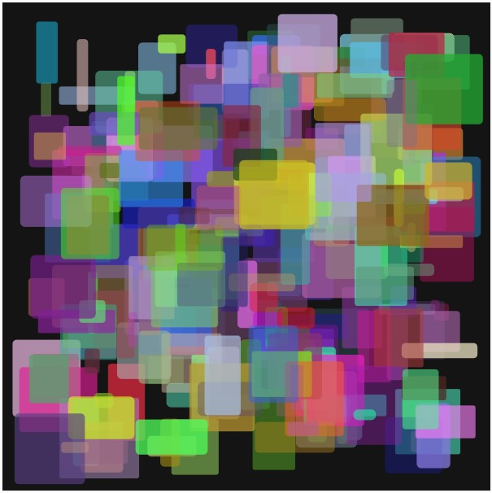
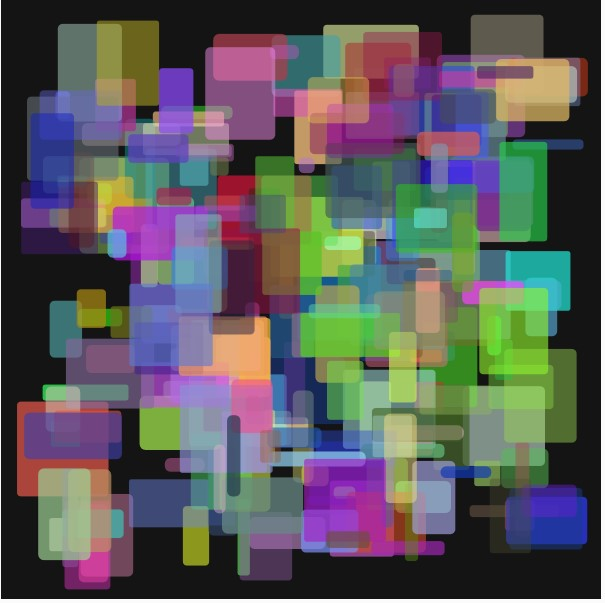
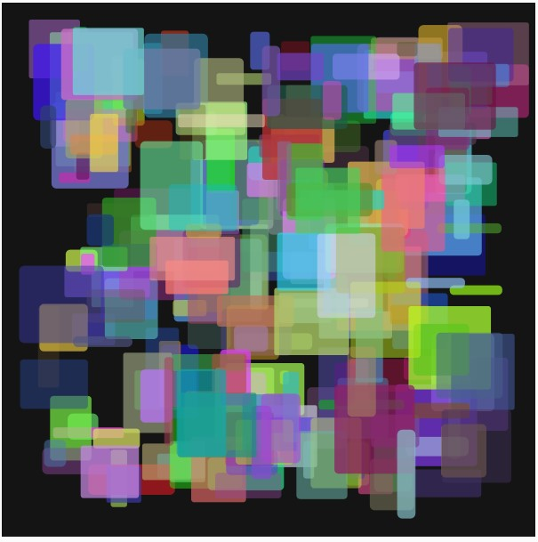

## Documentation for Assignment 3
---
Feb 12:
So from professor [Aaron Sherwood Cars Example](https://editor.p5js.org/aaronsherwood/sketches/JO7e1p6aDr) code I decided to understand how he created the arrays and class for the cars. After analyzing this code I decided to implement my own class for Rectangles. From professor Aaron code I understood that I could use the built in function `color()` to send an RGBA value as an input to the class. For my design I decided to draw different sized rectangles in different positions of the canvas with different color and opacity. It was pretty similar to my previous assignment in which I used For Loops to call the functions that drew the shapes of different colors. Below are the results of three images, and the code:

Images: 







Code: 

````
// variables for the project
let myRectsArray = []; // array for rectangles
// variables for colors
let r
let g
let b
let a 

function setup() {
  createCanvas(600, 600); //leave the screen size the same
  background(20);
  rectMode(CENTER); // create every rectangle from their center point

  
  //create 250 rectangles random
  for (let i = 0; i < 250; i++){
    // assign color variables for the rectangle class
    r = int(random(15,255));
    g = int(random(15,255));
    b = int(random(15,255));
    a = int(random(100,200));
    print(r,g,b,a)
    
    //push into the array the NEW object created
    myRectsArray.push(new Rects(random(10,100), random(10,100), random(2,6),color(r,g,b,a)))
    
  }

  
  //showing the rectangles i have in the array
  for (let i = 0; i < myRectsArray.length; i++){
    myRectsArray[i].show();
  }
}

//function draw() {

// }

class Rects{
  //set up the constructor
  constructor(wid,hgt,rnd,clr){ // inside the round parenthesis the variables as inputs
    //variables that will work in the class
    // input variables to the constructor
    this.wid = wid; 
    this.hgt = hgt;
    this.rnd = rnd;
    this.rectColor = clr;
    //additional variables
    this.posX = random(50,550) // 
    this.posY = random(50,550)
    
  }
  //function that displays the rectangles in the screen
  show(){
    this.drawRect();
  }
  
  drawRect(){
    fill(this.rectColor);
    noStroke();
    rect(this.posX, this.posY, this.wid, this.hgt, this.rnd);
    
  }
   
}

````

---
The idea is now to make each of the rectangles rotate around their center at different speeds in their location where they are created. For this I will be using the functions `translate()` and `rotate()`
