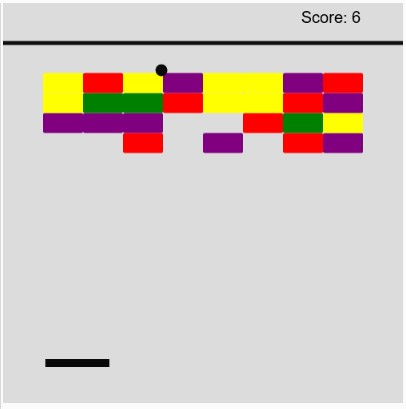
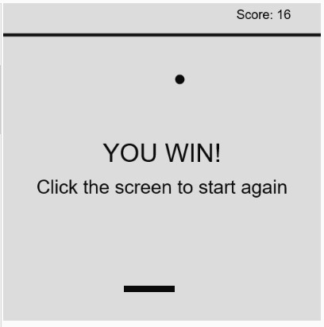

This midterm project emulates the classic Atari game Breakout. Although I looked to do a small variation in my inital concept, with falling object that the user needed to avoid in addition to breaking all the bricks, I sticked with the normal game. In this game the user needs to break a wall of 32 bricks, each brick has a different color which signifies the number of hits that it needs before it breaks. 

The user is encountered by a menu with the instructions of the game, after clicking the screen the game begins. Each time the ball hits the paddle and the bricks there is a sound. When a brick is destroyed the score changes, regardless of the color of the brick each brick destroyed is worth 1 point. When the user loses or wins there is a sound for each scenario. Finally after the user presses again the screen they restart a new game.

Recreating this game was a great experience to understand the capabilities of p5js and how to apply the knowledge learned in these past few weeks. Below are some images about the game.

