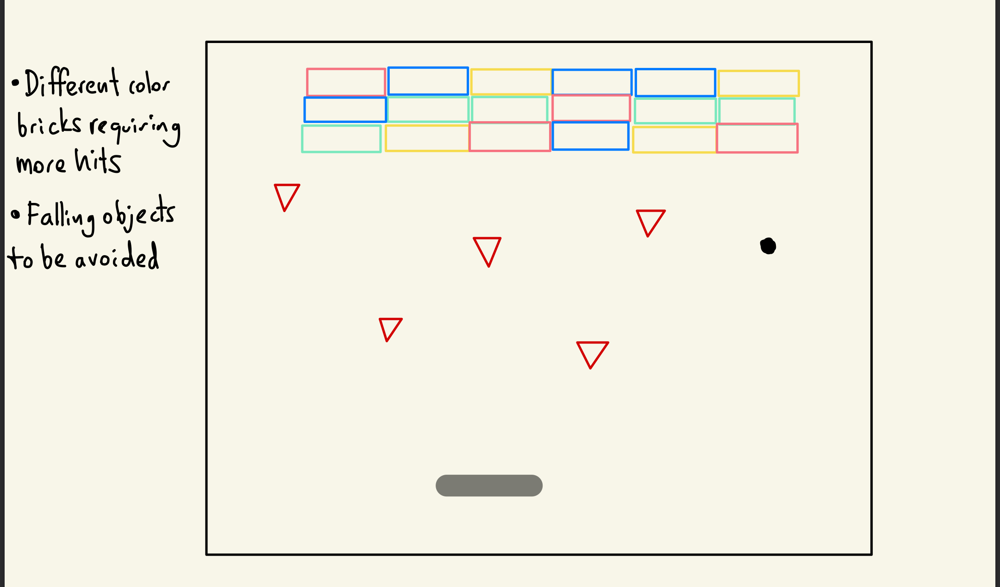
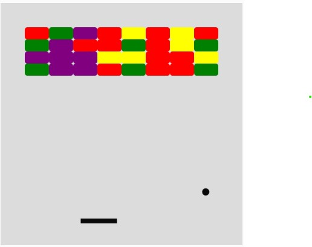
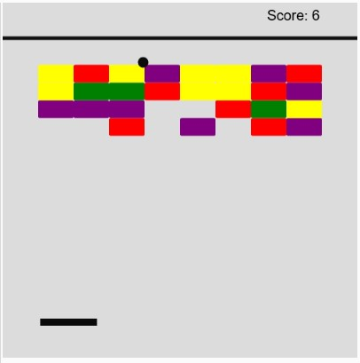
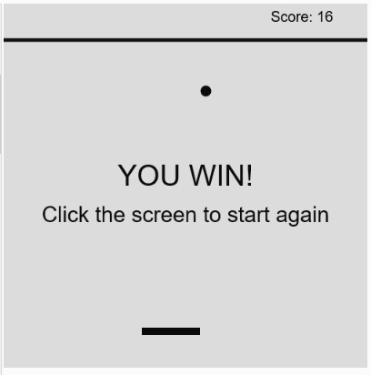
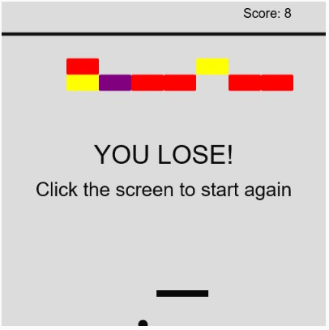

## Midterm Project

The following markdown file hopes to explain the initial concept for my Midterm Project, in addition discuss the riskiest or most complicated element in the program.

### Concept of the project

My initial idea for the project is to do the Breakout Atari game. This classic game main objective is to break a wall of bricks with a ball and paddle. However, I was planning to add some changes to the game, in this case primarily the brick wall with have bricks with different values (needs more hits to be destroyed) and falling objects that need to be avoided by the user while playing the game. 



### Most complicated element

I believe that the most complicated element for now is getting right the collisions. We had seen an example in class of how to do a bouncing ball on the edges of the canvas. However, this now needs to be applied to objects within the canvas, in this case the bricks and the paddle. 


### First Update: Bricks, Paddle Movement and Bouncing Ball

For the first part, I worked on creating the brick wall with classes and random colors. Fortunately, I had done this task before for my Generative Art Assignment with Classes. So I reused code blocks from there, but this time rearranged the way the rectangles were displayed on screen. In this case, I ordered the bricks in rows and columns. 


After that I created the paddle and used the `keyIsPressed` to check if the arrows were pressed. I noticed that there was a strange bug that required the screen to be clicked in order to use the arrow keys. In a [tutorial](https://www.youtube.com/watch?v=3GLirU3SkDM) that I watch that guided me for the later parts also mentioned about this issue, don't know if it has been officially reported to the p5.js team. 

At the same time I created the ball, for this I used the [class example](https://github.com/michaelshiloh/resourcesForClasses/tree/master/src/p5jsSketches/simpleP5jsClassExample) we had with bouncing ball with classes. Initially I just used the code for one ball, not creating a class, in later stages a changed this to a class ball. At this stage of the code I let the ball bounce on all edges without creating the bottom edge to finish the game.



### Second Update: Collision with Paddle 

Before explaining how I did the collisions for the paddle, I decided to change the movement of the paddle from keyboard to mouseX. Partly to avoid the click the screen bug before using the keyboard and because it is faster, so it allows the user to react faster to the movement of the ball. For this stage, I decided to use one of the methods to check collisions shared in this video [8.4 Class and Objects - Collision Detection - p5.js Tutorial](https://www.youtube.com/watch?v=cZ_VHAT_Sq4&t=744s). The first method suggested utilizing the `dist` method in p5js, intially I struggled finding the collision point between the paddle and the ball. But after using print statements to debug the code I identified the distance between the paddle and the ball while the paddle was moving. 

```
distPaddleBall = int(dist(this.xPos, this.yPos, mouseX, 445));
    //checking for the values commented out
    //print("Distance",distPaddleBall,"xPosRect", xPosRect, "Y",bally);
    if (distPaddleBall > 0 && distPaddleBall < 40 && this.yPos > 445)
```

As you can see in the code fragment above that is in my checkPaddle() method inside the class movingBall, I use the `dist()` method and intially I had some print statements that helped me identify what was the distance between the paddle and the ball when they collided. Therefore I used those values for the if statment with 3 ands so that the condition was true. I believe this way was better using the `dist()` method as the paddle is constantly updating based on the mouseX position rather than trying to do a series of and statements for each possible position the paddle could be. 

### Third Update: Collision with Bricks 

This update was the hardest of all. I struggled a lot on grasping the concept of how to check for each individual brick if the ball was colliding. Also I had no idea how would I make the brick disappear after the collision. Initially I was thinking of making the bricks opacity 0, but the problem is that technically the brick will still be there. Therefore, I had to check different tutorials, firstly the one I mentioned previously was [Coding Garden - Build a Brick-Breaker game with P5.js - Special Guest Brooks Builds](https://www.youtube.com/watch?v=3GLirU3SkDM), then [xin xin - 8.4 Class and Objects - Collision Detection - p5.js Tutorial](https://www.youtube.com/watch?v=cZ_VHAT_Sq4&t=744s) and [vhHacks - Atari Breakout Workshop in p5.js](https://www.youtube.com/watch?v=y8yiseJU8r4). Particulary the first and the last showed me a particular method for lists to eliminate the bricks, which is `splice()`. This method allows to eliminate a specific element in the list meaning that the brick diplayed on screen will completely disappear and not affecting future collisions.

```
 for (i = myRectsArray.length - 1; i >= 0; i--) {
      //print("i is:", i);
      const brick = myRectsArray[i];
      if (brick.rectCollision(myCircle)) {
        //print("HIT, i is:", i )
        myCircle.changeDirection("y");
        if (brick.hits === 0) {
          myRectsArray.splice(i, 1); // eliminate the rectangle
          print(myRectsArray.length, "length")
        }
      } else {
        brick.displayRect(); // show the Rectangle
      }
```

This code fragment had some influence on Coding Garden's tutorial. Particulary the use of the for loop to run through my array of bricks and check if for each brick in the array there was a collision at that moment with `brick.rectCollision(myCircle)`. This particular for loop is characterized for going through the list backwards thanks to the `i = myRectsArray.length - 1`  statement at the beginning.


### Fourth Update: Game Scenes, Sound and Images

Firstly, I set three game scenes, the menu, the game itself and a win or lose scene. As I had not implemented text yet, the last scene was just print statements with if else statements. Particularly, I focused on the transition from the menu to the game by clicking the screen using the `mousePressed` method. 

The other stage was pretty simple as I just had to search for the sounds that I needed for. The sounds that I used and their sources are in the `sounds` folder of this repository. In terms of the images I design a menu with the instructions for the games on Inkscape. The only issue I was having initially with the preload function was the fact that my sound files were particularly large as they were .wav files. Luckily, by using Ableton Live I was able to export each audio file into .mp3, which reduced their size. Setting each specific sound to a logical aspect of the game was not as hard because it just meant "when X is happening/occurs reproduce sound Y." Below a code fragment showing this example:

```
  //brcik checking collision with ball
  rectCollision(ball) {
    // several statements with &&

    if (
      ball.yPos + ball.size >= this.yPosition + this.height / 2 &&
      ball.yPos - ball.size <= this.yPosition - this.height / 2 &&
      ball.xPos + ball.size >= this.xPosition - this.width / 2 &&
      ball.xPos + ball.size <= this.xPosition + this.width / 2
    ) {
      this.brickSound.play();//play sound each hit
      this.hits -= 1; // reduce the hit number
      return true; // confirm there is a collision
    }
  }
```

In this case when all the and statements are true in the `if`, the code reproduces `this.brickSound.play()` in the method `rectCollision(ball)`.


### Fifth Update: Points and Restarting Game

Finally after editing all the details in the game, I worked on doing text displaying the score and you win and you lose. Initially I was having a bug in which the game did not end. Apparently when I had my list of bricks empty I forgot to check thegame state to change the screen to the end. It is interesting how small details can be forgotten and give you a headache when testing the game. 

In regards of the point, each time a brick is destroyed the player gets 1 point, the difference is just that for each color it requires more hits to destroy it. This helped me making simple the code, as I believe that I would have gotten more errors if I tried to implement more points for the bricks that required more hits.








### Final Thoughts

Overall, programming this game was challenging especially with the collisions. Although I managed to implement them for both bricks and paddle with two different methods there are still some bugs present. In the bricks there are sometimes that even though it touches one of the corners the ball does not bounce, or sometimes it bounces within the bricks giving the user more hits than it should. This is something that I need to improve if I do an update, also adding the falling elements that the user needs to avoid would be a nice update to include to make the game different from the classic Atari Breakout.
