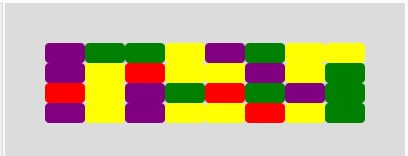

### Midterm Project

The following markdown file hopes to explain the initial concept for my Midterm Project, in addition discuss the riskiest or most complicated element in the program.

#### Concept of the project

My initial idea for the project is to do the Breakout Atari game. This classic game main objective is to break a wall of bricks with a ball and paddle. However, I was planning to add some changes to the game, in this case primarily the brick wall with have bricks with different values (needs more hits to be destroyed) and falling objects that need to be avoided by the user while playing the game. 

#### Most complicated element

I believe that the most complicated element for now is getting right the collisions. We had seen an example in class of how to do a bouncing ball on the edges of the canvas. However, this now needs to be applied to objects within the canvas, in this case the bricks and the paddle. 

#### First Update: Bricks, Paddle Movement and Bouncing Ball

For the first part, I worked on creating the brick wall with classes and random colors. Fortunately, I had done this task before for my Generative Art Assignment with Classes. So I reused code blocks from there, but this time rearranged the way the rectangles were displayed on screen. In this case, I ordered the bricks in rows and columns. 

(SCREENSHOT OF THE BLOCKS DISPLAYED)

After that I created the paddle and used the `keyIsPressed` to check if the arrows were pressed. I noticed that there was a strange bug that required the screen to be clicked in order to use the arrow keys. In a [tutorial](https://www.youtube.com/watch?v=3GLirU3SkDM) that I watch that guided me for the later parts also mentioned about this issue, don't know if it has been officially reported to the p5.js team. 

At the same time I created the ball, for this I used the class example we had with bouncing ball with classes. Initially I just used the code for one ball, not creating a class, in later stages a changed this to a class ball. At this stage of the code I let the ball bounce on all edges without creating the bottom edge to finish the game.

#### Second Update: Collision with Paddle 

#### Third Update: Collision with Bricks 

#### Fourth Update: Game Scenes, Sound and Images

Firstly, I set three game scenes, the menu, the game itself and a win or lose scene. As I had not implemented text yet, the last scene was just print statements with if else statements. Particularly, I focused on the transition from the menu to the game by clicking the screen using the `mousePressed` method. 

The other stage was pretty simple as I just had to search for the sounds that I needed for. The sounds that I used and their sources are in the `sounds` folder of this repository. In terms of the images I design a menu with the instructions for the games on Inkscape. The only issue I was having initially with the preload function was the fact that my sound files were particularly large as they were .wav files. Luckily, by using Ableton Live I was able to export each audio file into .mp3, which reduced their size. Setting each specific sound to a logical aspect of the game was not as hard because it just meant "when X is happening/occurs reproduce sound Y." 

#### Fifth Update: Points and Restarting Game

Finally after editing all the details in the game, I worked on doing text displaying the score and you win and you lose. Initially I was having a bug in which the game did not end. Apparently when I had my list of bricks empty I forgot to check thegame state to change the screen to the end. It is interesting how small details can be forgotten and give you a headache when testing the game. 

In regards of the point, each time a brick is destroyed the player gets 1 point, the difference is just that for each color it requires more hits to destroy it. This helped me making simple the code, as I believe that I would have gotten more errors if I tried to implement more points for the bricks that required more hits.

#### Final Thoughts

Overall, programming this game was challenging especially with the collisions. Although I managed to implement them for both bricks and paddle with two different methods there are still some bugs present. In the bricks there are sometimes that even though it touches one of the corners the ball does not bounce, or sometimes it bounces within the bricks giving the user more hits than it should. This is something that I need to improve if I do an update, also adding the falling elements that the user needs to avoid would be a nice update to include to make the game different from the classic Atari Breakout.
